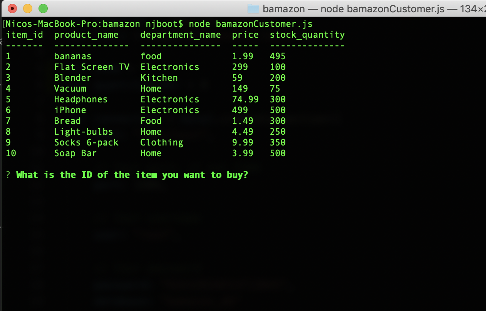
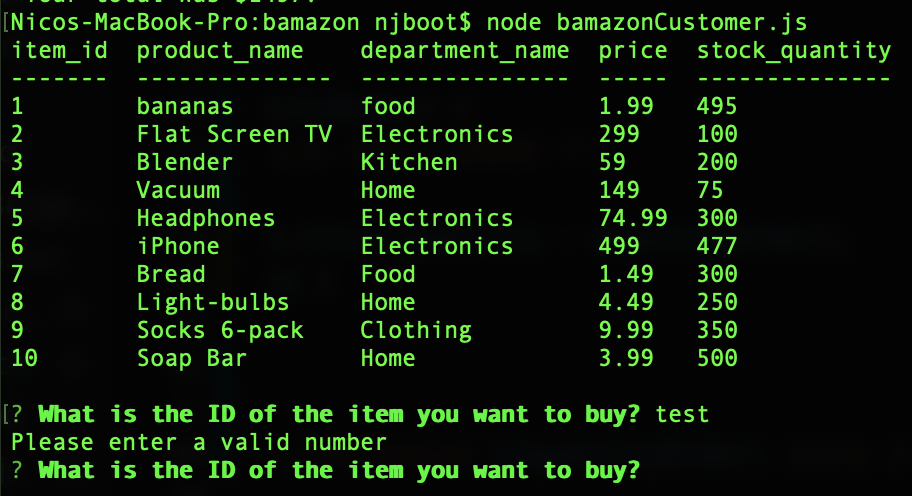

# bamazon

This is an Amazon-like storefront created using MySQL. The app takes in orders from customers and depletes stock from the store's inventory. As a bonus task, you can program your app to track product sales across your store's departments and then provide a summary of the highest-grossing departments in the store.

bamazon table:

working app:

input validation:

manager view:

manager table:

manager low inventory:

Credit to "https://github.com/emilyhosoya/bamazon/blob/master/bamazonCustomer.js" for help with SQL query syntax.